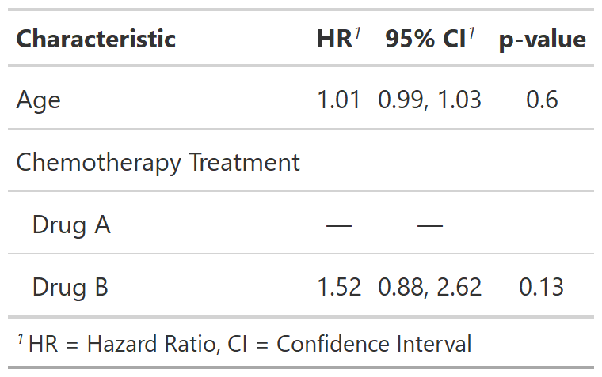

<!-- README.md is generated from README.Rmd. Please edit that file -->

```{r, include = FALSE}
knitr::opts_chunk$set(
  collapse = TRUE,
  comment = "#>",
  fig.path = "man/figures/README-",
  out.width = "100%"
)
```

# tidycmprsk

<!-- badges: start -->
[](https://github.com/MSKCC-Epi-Bio/tidycmprsk/actions)
[](https://codecov.io/gh/MSKCC-Epi-Bio/tidycmprsk?branch=main)
<!-- badges: end -->

  The goal of `tidycmprsk` is to provide a compatible wrap of the competing risks analysis R package `cmprsk`, such that the output objects can work with methods like `model.frame()`, `model.matrix()`, `tidy()`, and so on. This package can be incorporated with `gtsummary` to provide convenient summary of competing risks models. 

Currently, the package supports Fine and Gray's subdistribution hazard model (function `crr`). The non-parametric cumulative incidence function (function `cuminc`) is under development.

## Installation

You can install the released version of tidycmprsk from GitHub

``` r
# install.packages("devtools")
devtools::install_github("MSKCC-Epi-Bio/tidycmprsk")
```
## Example

Fit a Fine and Gray model for the example data `trial` with covariate `age`.

```{r example}
library(tidycmprsk)

crr_mod <- crr(Surv(ttdeath, death_cr) ~ age + trt, trial)
crr_mod
```

The `tidycmprsk` plays will with other packages, such as `gtsummary`.

```{r gtsummary, message = FALSE}
library(gtsummary)

tbl <- tbl_regression(crr_mod, exponentiate = TRUE)
```

```{r gtsummary_print, include = FALSE}
# Had to manually save images in temp file, not sure if better way.
gt::gtsave(as_gt(tbl), file = file.path(tempdir(), "temp.png"))
```

```{r out.width = "60%", echo = FALSE}
# Have to do this workaround since the README needs markdown format for GitHub page but a different format for the website.
if (identical(Sys.getenv("IN_PKGDOWN"), "true")) {
  tbl
} else {
  
} 
```
