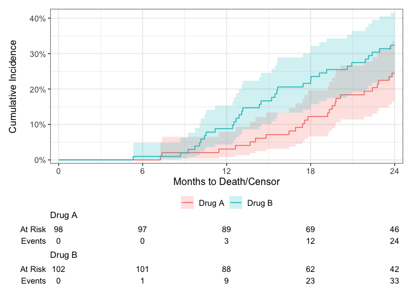

<!-- README.md is generated from README.Rmd. Please edit that file -->

# tidycmprsk <a href="https://mskcc-epi-bio.github.io/tidycmprsk/"></a>

<!-- badges: start -->

[](https://github.com/MSKCC-Epi-Bio/tidycmprsk/actions/workflows/R-CMD-check.yaml)
[](https://app.codecov.io/gh/MSKCC-Epi-Bio/tidycmprsk?branch=main)
[](https://cran.r-project.org/package=tidycmprsk)
[](https://cran.r-project.org/package=tidycmprsk)
<!-- badges: end -->

The `tidycmprsk` package provides an intuitive interface for working
with the competing risk endpoints. The package wraps the `cmprsk`
package, and exports functions for univariate cumulative incidence
estimates with `cuminc()` and competing risk regression with `crr()`.

The package also includes broom-style tidiers: `tidy()`, `augment()`,
and `glance()`.

## Installation

You can install {tidycmprsk} with the following code.

``` r
install.packages("tidycmprsk")
```

Install the development version of {tidycmprsk} with:

``` r
# install.packages("devtools")
devtools::install_github("MSKCC-Epi-Bio/tidycmprsk")
```

## Competing Risk Regression

Fit a Fine and Gray competing risks regression model using the the
example data, `trial`.

``` r
library(tidycmprsk)

crr_mod <- crr(Surv(ttdeath, death_cr) ~ age + trt, trial)
#> 11 cases omitted due to missing values
crr_mod
#> 
#> ── crr() ───────────────────────────────────────────────────────────────────────
#> • Call Surv(ttdeath, death_cr) ~ age + trt
#> • Failure type of interest "death from cancer"
#> 
#> Variable    Coef    SE      HR     95% CI       p-value    
#> age         0.006   0.010   1.01   0.99, 1.03   0.56       
#> trtDrug B   0.417   0.279   1.52   0.88, 2.62   0.13
```

The `tidycmprsk` plays well with other packages, such as `gtsummary`.

``` r
tbl <- 
  crr_mod %>%
  gtsummary::tbl_regression(exponentiate = TRUE) %>%
  gtsummary::add_global_p(anova_fun = gtsummary::tidy_wald_test) %>%
  add_n(location = "level")
```


``` r
gtsummary::inline_text(tbl, variable = age)
#> [1] "1.01 (95% CI 0.99, 1.03; p=0.6)"
```

## Cumulative Incidence

``` r
cuminc(Surv(ttdeath, death_cr) ~ 1, trial)
#> 
#> ── cuminc() ────────────────────────────────────────────────────────────────────
#> • Failure type "death from cancer"
#> time   n.risk   estimate   std.error   95% CI          
#> 5.00   199      0.000      0.000       NA, NA          
#> 10.0   189      0.030      0.012       0.012, 0.061    
#> 15.0   158      0.120      0.023       0.079, 0.169    
#> 20.0   116      0.215      0.029       0.161, 0.274
#> • Failure type "death other causes"
#> time   n.risk   estimate   std.error   95% CI          
#> 5.00   199      0.005      0.005       0.000, 0.026    
#> 10.0   189      0.025      0.011       0.009, 0.054    
#> 15.0   158      0.090      0.020       0.055, 0.135    
#> 20.0   116      0.205      0.029       0.152, 0.264
```

Plot risks using using the {ggsurvfit} package.

``` r
library(ggsurvfit)
#> Loading required package: ggplot2

cuminc(Surv(ttdeath, death_cr) ~ trt, trial) %>%
  ggcuminc() +
  add_confidence_interval() +
  add_risktable()
#> Plotting outcome "death from cancer".
```



Summary table

``` r
tbl <- 
  cuminc(Surv(ttdeath, death_cr) ~ trt, trial) %>%
  tbl_cuminc(times = c(12, 24), label_header = "**Month {time}**") %>%
  add_p() %>%
  add_n()
```


## Contributing

Please note that the {tidycmprsk} project is released with a
[Contributor Code of
Conduct](https://mskcc-epi-bio.github.io/tidycmprsk/CODE_OF_CONDUCT.html).
By contributing to this project, you agree to abide by its terms. Thank
you to all contributors!  
[@ddsjoberg](https://github.com/ddsjoberg),
[@dublinQAQ](https://github.com/dublinQAQ),
[@erikvona](https://github.com/erikvona),
[@fdehrich](https://github.com/fdehrich),
[@hadley](https://github.com/hadley),
[@karissawhiting](https://github.com/karissawhiting),
[@Lamenace23](https://github.com/Lamenace23),
[@m-freitag](https://github.com/m-freitag),
[@mjtjmjtj](https://github.com/mjtjmjtj),
[@pteridin](https://github.com/pteridin),
[@ramashka328](https://github.com/ramashka328),
[@SoumyaRo](https://github.com/SoumyaRo), and
[@tengfei-emory](https://github.com/tengfei-emory)

#### Limitations

The `tidycmprsk` package implements most features (and more) available
in `cmprsk`. However, the time interaction features available in
`cmprsk::crr()` is not available in `tidycmprsk`.
